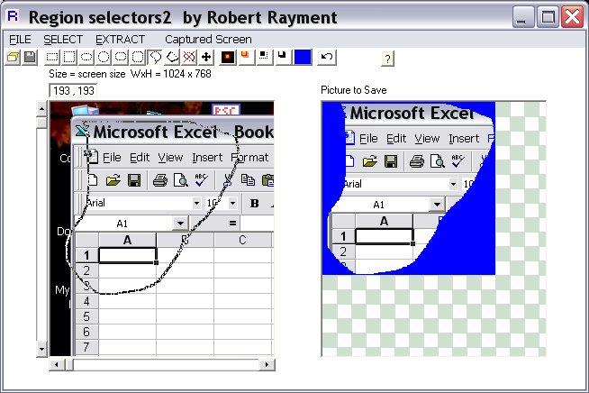

## Region Selector2

### Description

Region Selector2 by Robert Rayment. (Upgrade of Region Selector CodeId=60865). This allows a region to be drawn on any bmp, jpg or gif image in 8 different ways. This region can then be saved (bmp) on the same sized rectangle as the original or reduced to a rectangle containing just the region. Regions can be drawn over an area larger than that displayed by using the arrow keys, to operate the scroll bars, simultaneously with the mouse. So - useful for extracting images and making masks. Also included are ini recent files list and drag-drop onto input picture box or the exe.

----

Upgrade. Region Selector2 now has Screen Capture and Selectable Surround Color for Extracted Shape.

Zip 40 KB.
 
### More Info
 
Images

Just run

             |
---                |---
**Submitted On**   |2006-01-20 10:39:46
**By**             |[Robert Rayment](https://github.com/Planet-Source-Code/PSCIndex/blob/master/ByAuthor/robert-rayment.md)
**Level**          |Intermediate
**User Rating**    |5.0 (65 globes from 13 users)
**Compatibility**  |VB 6\.0
**Category**       |[Graphics](https://github.com/Planet-Source-Code/PSCIndex/blob/master/ByCategory/graphics__1-46.md)
**World**          |[Visual Basic](https://github.com/Planet-Source-Code/PSCIndex/blob/master/ByWorld/visual-basic.md)
**Archive File**   |[Region\_Sel1966861212006\.zip](https://github.com/Planet-Source-Code/robert-rayment-region-selector2__1-64090/archive/master.zip)

### API Declarations

See code

